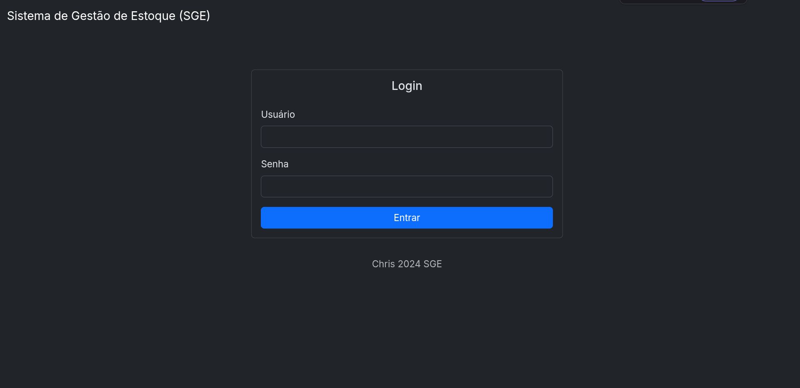
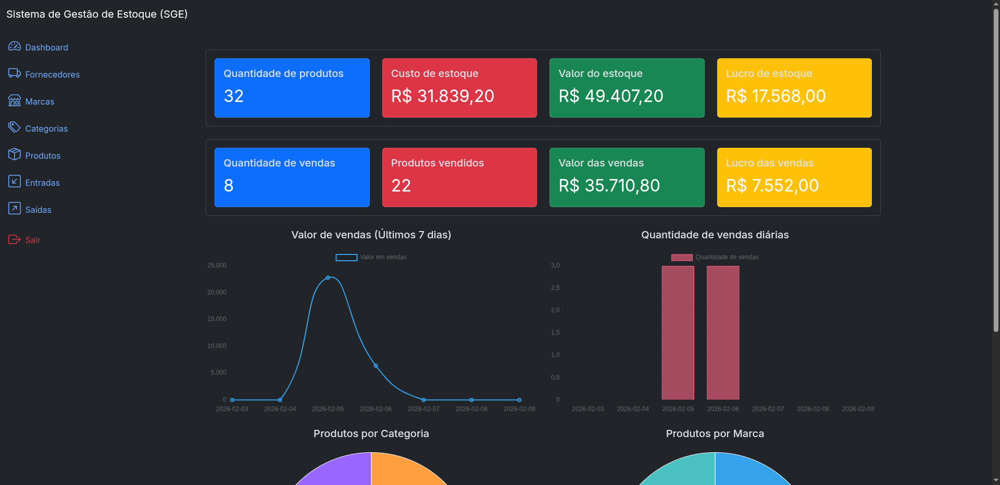
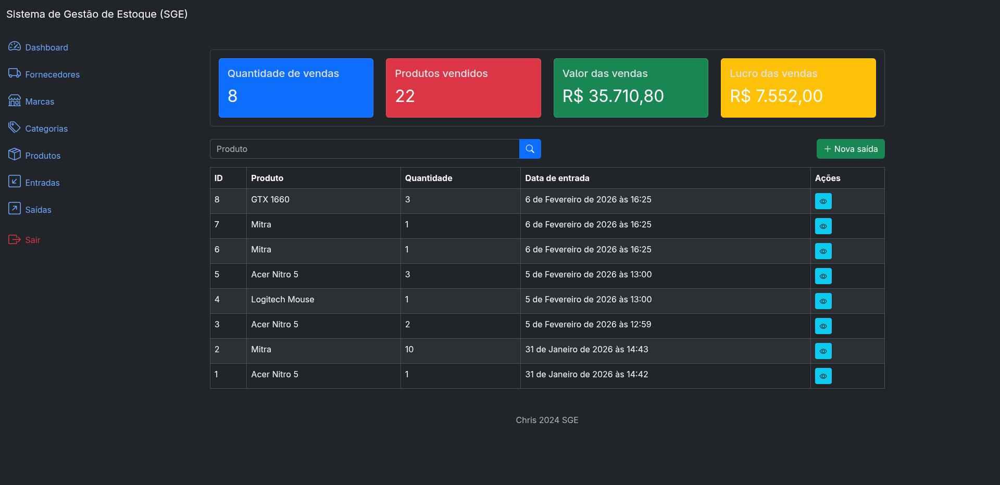

# Sistema de Gestão de Estoque (SGE)

Esta é uma aplicação web Django 6.0.1 com Bootstrap projetada para gerenciamento de estoque feita como parte do curso Django Master da PycodeBr.

## Funcionalidades
*   Gerencia marcas, categorias, fornecedores e produtos.
*   Possui autenticação e sistema de permissões de usuários do Django
*   Registra entradas e saídas de produtos.
*   Mostra métricas de produtos e vendas.
*   Inclui uma API REST com autenticação JWT.

## Imagens

### Tela de login


### Tela inicial


### Tela de saídas de produtos


## Configuração
1.  **Clone o repositório:**
    ```bash
    git clone <url_do_repositorio>
    cd sge
    ```
2.  **Crie e ative um ambiente virtual:**
    ```bash
    python -m venv venv
    source venv/bin/activate
    ```
3.  **Instale as dependências:**
    ```bash
    pip install -r requirements.txt
    pip install -r requirements_dev.txt
    ```
4.  **Crie um arquivo `.env`** na raiz do projeto com sua `SECRET_KEY`:
    ```
    SECRET_KEY='chave-secreta-do-django'
    ```
5.  **Aplique as migrações do banco de dados:**
    ```bash
    python manage.py makemigrations
    python manage.py migrate
    ```
6.  **Crie um superusuário:**
    ```bash
    python manage.py createsuperuser
    ```

## Executando a Aplicação
```bash
python manage.py runserver
```
A aplicação estará disponível em `http://127.0.0.1:8000/`.

## Endpoints da API
Os endpoints da API estão em `/api/v1/`.

**Autenticação:**
*   `POST /api/v1/authentication/token/` - Obter tokens de acesso e refresh.
*   `POST /api/v1/authentication/token/refresh/` - Atualizar o token de acesso.
*   `POST /api/v1/authentication/token/verify/` - Verificar a validade do token de acesso.

**Gerenciamento de Recursos (requer autenticação JWT):**
*   **Brands (Marcas):**
    *   `GET /api/v1/brands/` - Listar todas as marcas.
    *   `POST /api/v1/brands/` - Criar uma nova marca.
    *   `GET /api/v1/brands/<id>/` - Obter detalhes de uma marca específica.
    *   `PUT /api/v1/brands/<id>/` - Atualizar uma marca existente.
    *   `DELETE /api/v1/brands/<id>/` - Excluir uma marca.
*   **Categories (Categorias):**
    *   `GET /api/v1/categories/` - Listar todas as categorias.
    *   `POST /api/v1/categories/` - Criar uma nova categoria.
    *   `GET /api/v1/categories/<id>/` - Obter detalhes de uma categoria específica.
    *   `PUT /api/v1/categories/<id>/` - Atualizar uma categoria existente.
    *   `DELETE /api/v1/categories/<id>/` - Excluir uma categoria.
*   **Suppliers (Fornecedores):**
    *   `GET /api/v1/suppliers/` - Listar todos os fornecedores.
    *   `POST /api/v1/suppliers/` - Criar um novo fornecedor.
    *   `GET /api/v1/suppliers/<id>/` - Obter detalhes de um fornecedor específico.
    *   `PUT /api/v1/suppliers/<id>/` - Atualizar um fornecedor existente.
    *   `DELETE /api/v1/suppliers/<id>/` - Excluir um fornecedor.
*   **Products (Produtos):**
    *   `GET /api/v1/products/` - Listar todos os produtos.
    *   `POST /api/v1/products/` - Criar um novo produto.
    *   `GET /api/v1/products/<id>/` - Obter detalhes de um produto específico.
    *   `PUT /api/v1/products/<id>/` - Atualizar um produto existente.
    *   `DELETE /api/v1/products/<id>/` - Excluir um produto.
*   **Inflows (Entradas de Estoque):**
    *   `GET /api/v1/inflows/` - Listar todas as entradas.
    *   `POST /api/v1/inflows/` - Criar uma nova entrada.
    *   `GET /api/v1/inflows/<id>/` - Obter detalhes de uma entrada específica.
    *   `PUT /api/v1/inflows/<id>/` - Atualizar uma entrada existente.
    *   `DELETE /api/v1/inflows/<id>/` - Excluir uma entrada.
*   **Outflows (Saídas de Estoque/Vendas):**
    *   `GET /api/v1/outflows/` - Listar todas as saídas.
    *   `POST /api/v1/outflows/` - Criar uma nova saída.
    *   `GET /api/v1/outflows/<id>/` - Obter detalhes de uma saída específica.
    *   `PUT /api/v1/outflows/<id>/` - Atualizar uma saída existente.
    *   `DELETE /api/v1/outflows/<id>/` - Excluir uma saída.
